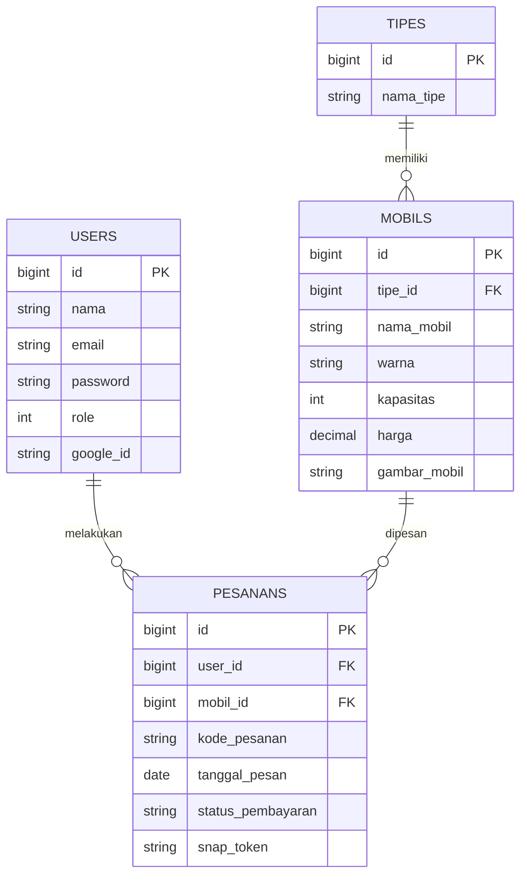
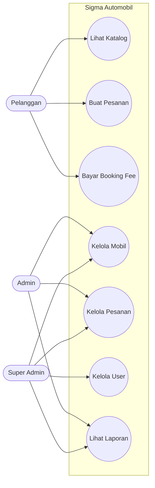
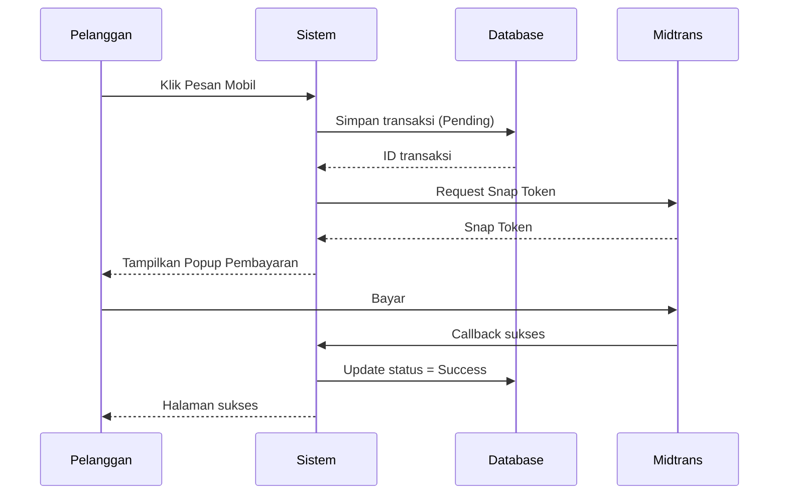
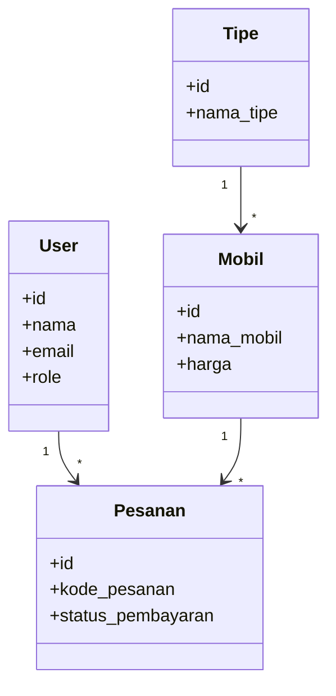

# 🚗 Sigma Automobil — Sistem Informasi Dealer Mobil Terintegrasi


**Sigma Automobil** adalah aplikasi web untuk sistem informasi penjualan dan pemesanan mobil modern. Sistem ini membantu pelanggan mulai dari pencarian katalog kendaraan, pembuatan pesanan (SPK), hingga pembayaran _booking fee_ secara aman melalui **Payment Gateway Midtrans**.

Di sisi internal, tersedia **Admin Dashboard** untuk mengelola data kendaraan, transaksi, pengguna, dan operasional dealer.

---

# ✨ Fitur Unggulan

## 🔐 1. Autentikasi Modern (SSO)

Pengguna dapat mendaftar secara manual atau masuk cepat menggunakan **Google OAuth 2.0**.

## 💳 2. Payment Gateway Otomatis

Terintegrasi dengan **Midtrans Snap API** untuk pembayaran _booking fee_ dengan validasi otomatis melalui **Webhook / Callback**.

## 🚘 3. Katalog Mobil Dinamis

Pencarian mobil lebih mudah dengan filter tipe kendaraan serta status ketersediaan unit.

## 👤 4. Member Area

Pelanggan dapat melihat riwayat transaksi, status pesanan, dan mengelola profil akun.

## 🛡️ 5. Role-Based Access Control (RBAC)

Hak akses dibedakan menjadi:

- **Pelanggan**
- **Admin**
- **Super Admin**

## 🎨 6. Modern UI/UX

Antarmuka bersih, responsif, dan nyaman digunakan di berbagai perangkat.

---

# 📸 Screenshot

> Tambahkan screenshot aplikasi pada bagian berikut:

- Beranda & Katalog Mobil
- Login & Google SSO
- Dashboard Admin
- Pembayaran Midtrans

---

# 📊 Arsitektur Sistem (UML)

## 1. Entity Relationship Diagram (ERD)



---

## 2. Use Case Diagram



---

## 3. Sequence Diagram — Pemesanan & Pembayaran



---

## 4. Class Diagram



---

# 📁 Struktur Direktori

```text
sigma-automobil/
├── app/
│   ├── Http/Controllers/
│   │   ├── Frontend/
│   │   └── Backend/
│   └── Models/
│
├── resources/views/
│   ├── frontend/
│   └── backend/
│
├── routes/
│   └── web.php
│
└── database/
    ├── migrations/
    └── seeders/
```

---

# 👥 Akun Demo

| Role        | Email                  | Password   |
| ----------- | ---------------------- | ---------- |
| Super Admin | `superadmin@gmail.com` | `password` |
| Admin       | `ichwan@gmail.com`     | `password` |
| Pelanggan   | `mario@gmail.com`      | `password` |

---

# 🚀 Instalasi

## Persyaratan

- PHP >= 8.1
- Composer
- MySQL / MariaDB
- Node.js & NPM

---

## 1. Clone Repository

```bash
git clone https://github.com/USERNAME_ANDA/sigma-automobil.git
cd sigma-automobil
```

---

## 2. Install Dependency

```bash
composer install
npm install
npm run build
```

---

## 3. Konfigurasi `.env`

```bash
cp .env.example .env
```

Isi konfigurasi:

```env
DB_CONNECTION=mysql
DB_HOST=127.0.0.1
DB_PORT=3306
DB_DATABASE=db_sigma_automobil
DB_USERNAME=root
DB_PASSWORD=

MIDTRANS_SERVER_KEY=your_server_key
MIDTRANS_CLIENT_KEY=your_client_key

GOOGLE_CLIENT_ID=your_google_id
GOOGLE_CLIENT_SECRET=your_google_secret
```

---

## 4. Generate Key & Migrasi

```bash
php artisan key:generate
php artisan migrate:fresh --seed
```

---

## 5. Storage Link

```bash
php artisan storage:link
```

---

## 6. Jalankan Aplikasi

```bash
php artisan serve
```

Akses di browser:

```text
http://127.0.0.1:8000
```

---

# 📌 Teknologi yang Digunakan

- Laravel
- Bootstrap
- MySQL
- Midtrans API
- Google OAuth
- JavaScript
- Blade Template Engine

---

# 👨‍💻 Developer

Dibuat untuk keperluan **Project Web Programming 3**  
© 2026 Sigma Automobil
